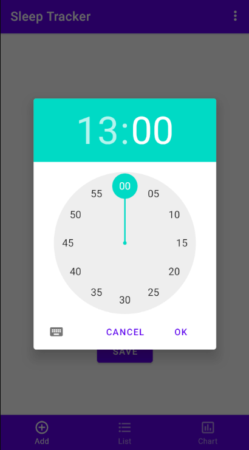

# Android Sleep Tracker

App keeps track of how much a user sleeps.

## Main features
* Sign in (register)
* Save your sleep data
* List your given sleep data
* Visualize your sleep data (*in progress*)

## Sign in (register)

To use the app users must sign in with an account (or create a new one). This is done via Firebase Authentication.

## Save sleep data

A user can save their sleep data by providing the start and end times of their nap. 

Data is saved to Cloud Firestore.

## List sleep data

User can specify what data they want to see by using a query between two dates.

## Visualize sleep data

*In Progress*
